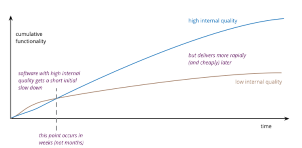

# Pragmatic Programming for Data Scientists
*Tips to deliver better analytics solutions faster*
![[book_cover.jpg]]

---
## BLUF
- Data Scientists can deliver more value to clients by embracing pragmatic programming principles!
	1. Don't Repeat Yourself (DRY)
	2. Decoupling
	3. Don't outrun your headlights

---
## Why Should I Care?
As a data scientist you might have great ideas. If you can't implement them reliably in your code, they will never make an impact!
 

---
## Why Should I Care?

When Data Scientists **ignore** programming principles they are more likely to:
1. make mistakes %%You need to know what your code does!%%
2) miss deadlines  %%90 percent of your dev time will be spent doing non-DS stuff%%
3) experience stress %%Diving back to a mistake you made months ago%%

Data Scientists who **embrace** programming principles deliver projects with greater:
1) maintainability %%You can make future changes faster%%
2) reliability %%your code is more likely to do what you say it does. It will also be clear to other DS what your code does%%
3) learnability %%If you get promoted, moved to another project, expand the team. Your code can be used by someone else!%%

---
## Disclaimers
1. Speak up! %%These are not secrets. Everyone knows this stuff and has valuable perspective. I don't need to finish all my slides%%
	- We do **NOT** need to finish my slides
2. This is relevant for everyone %%This helps anyone who writes code write it better. but its also good for managers to encourage their underlings to read up. and have a shared language around code quality%%
3. Cut me some slack %%I don't follow my advice here all the time. But I'm working on it!%%
4. Dive deeper %%Or some equivalent, if you want the full picture%%

---
### Software Entropy
*AKA: Technical Debt*
%%Has anyone ever looked at a codebase and felt like their looking at something like this?%%
<html>

</html>

[[TPP#2.-Software Entropy]]
[[TPP#33.-Refactoring]]
%%Reference back to the flattening of the curve in that graph%%
%%technical debt makes it harder to deliver, pivot, generate new ideas%%
%%An ounce of prevention is worth a pound of cure%%

---
### Software Entropy
%%This anecdote reflects my views on software, NOT LAW ENFORCEMENT%%
>One **broken window**, instills in the inhabitants of the building a sense of abandonment—a sense that the powers that be don't care about the building. So another window gets broken. People start littering. Serious structural damage begins. the building becomes damaged beyond the owner's desire to fix it, and the sense of abandonment becomes reality.

---
### Don't Repeat Yourself (DRY)
[[TPP#7.-The Evils of Duplication]]
*Every piece of knowledge must have a single, unambiguous, authoritative representation within a system.*
%%QUESTION: 
Has anyone ever made a simple change to the code but needed to change it like 100 times throughout the codebase??
you may not be DRY
%%

---
### DRY Example

---
### Decoupling - Example
![[Pasted image 20230622160221.png]]

---
### Decoupling - Example

![[Pasted image 20230622163110.png]]

---
### Decoupling - Example

![[highline.png]]

---
### Decoupling - DS Example
%%Changing a column name%%

---
### Programming by Coincidence
- just because something *looks right* doesn't mean it is
- why is correctness, stability

---
## Programming by Coincidence Example

---
## Conclusion
Invest in your coding skills because it will pay off big time.

>Debugging is twice as hard as writing the code in the first place. Therefore, if you write the code as cleverly as possible, you are, by definition, not smart enough to debug it. - Kernhigan's Law

---
### Tools Referenced
*All python, all open source*
- [MLFlow](https://mlflow.org/docs/latest/index.html) - Log experiments, version, and serve models
- Hydra - Config and experiment management
- [VSCode Debugger](https://code.visualstudio.com/docs/editor/debugging)
- [VSCode Test Explorer UI](https://marketplace.visualstudio.com/items?itemName=hbenl.vscode-test-explorer)
- [Sphinx](https://www.sphinx-doc.org/en/master/)
	- automate your API documentation
- [cProfile](https://docs.csc.fi/computing/cProfile/)
	- measure what is slowing your code  
- [Fire](https://github.com/google/python-fire)
	- Low-code CLI  
- [dotenv](https://github.com/theskumar/python-dotenv)
	- Load environment variables easily  
- [black](https://pypi.org/project/black/)
	- automate code formatting (PEP-8)  
- [isort](https://pypi.org/project/isort/)
	- automate import sorting  

---

### References  
- [The Pragmatic Programmer](https://www.amazon.com/Pragmatic-Programmer-journey-mastery-Anniversary/dp/0135957052)
	- [Free Summary](https://github.com/HugoMatilla/The-Pragmatic-Programmer)
- [Pragmatic Programmer for ML](https://www.taylorfrancis.com/books/mono/10.1201/9780429292835/pragmatic-programmer-machine-learning-marco-scutari-mauro-malvestio)  
- [Scaling ML Adoption: Pragmatic Approach](https://www.youtube.com/watch?v=AUvAdkDvvto)  
- [Write decoupled code — Good research code](https://goodresearch.dev/decoupled.html)
- [Designing Machine Learning Systems](https://learning.oreilly.com/library/view/designing-machine-learning/9781098107956/)
- [Debugging: The 9 Indespensable Rules](https://www.amazon.com/Debugging-Indispensable-Software-Hardware-Problems/dp/0814474578)
	- [Free Summary](https://inspirezone.tech/9-indispensable-rules-for-debugging-software-and-hardware/)
- [How Principled Coders Outperform the Competition](https://www.youtube.com/watch?v=q1qKv5TBaOA])

---
